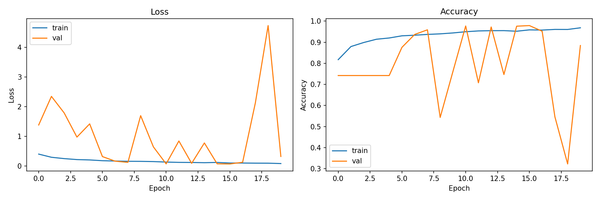
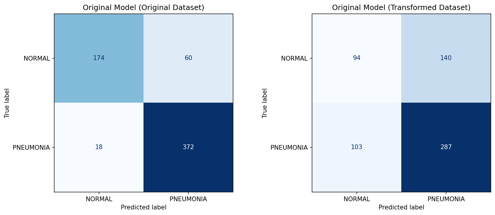
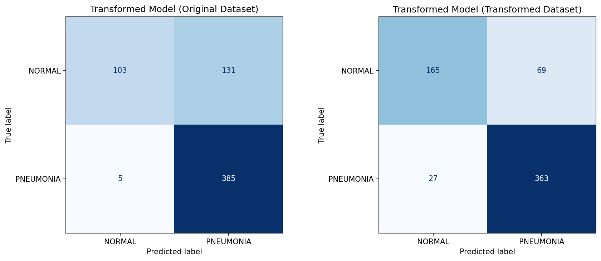
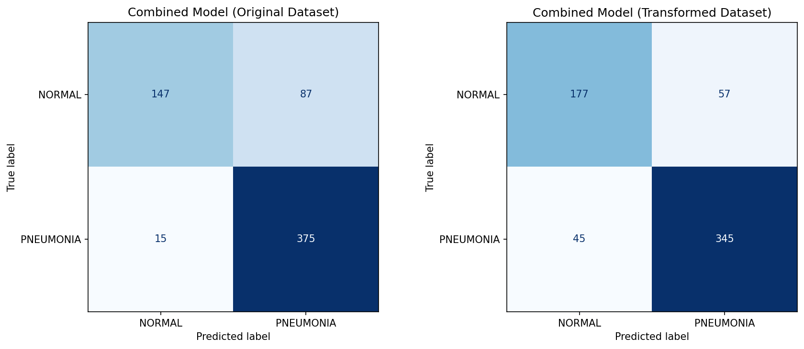
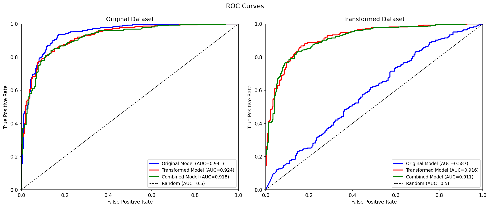
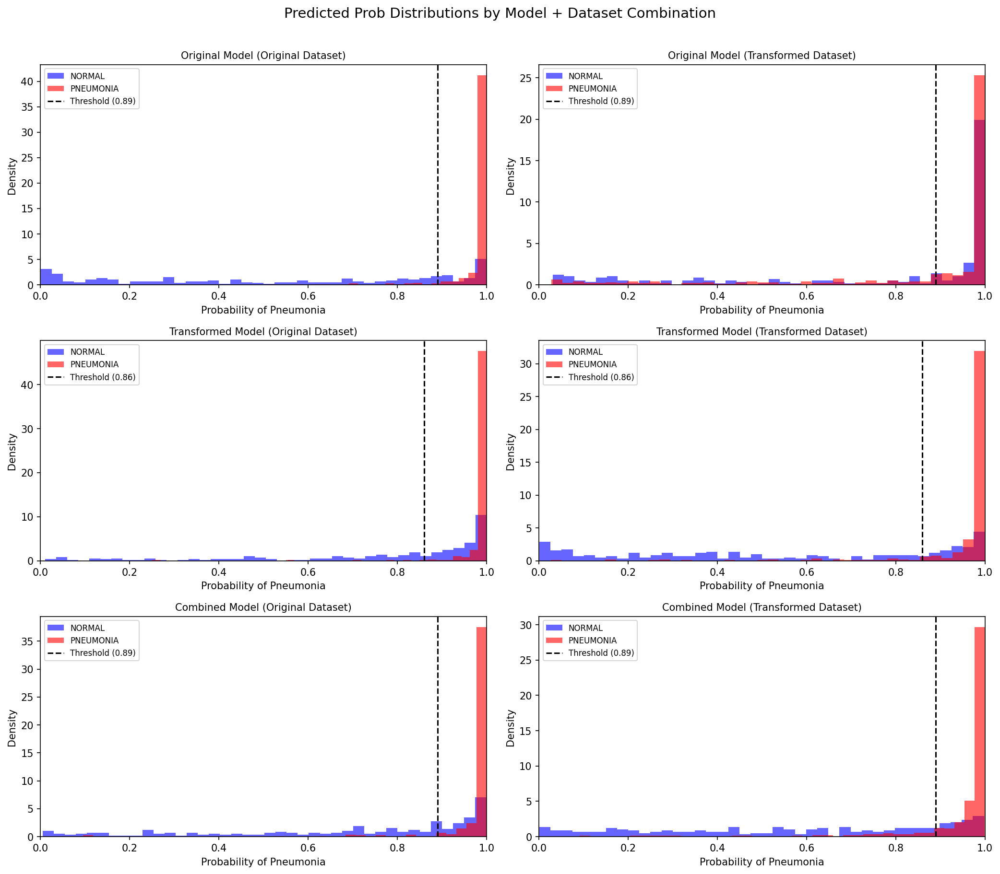
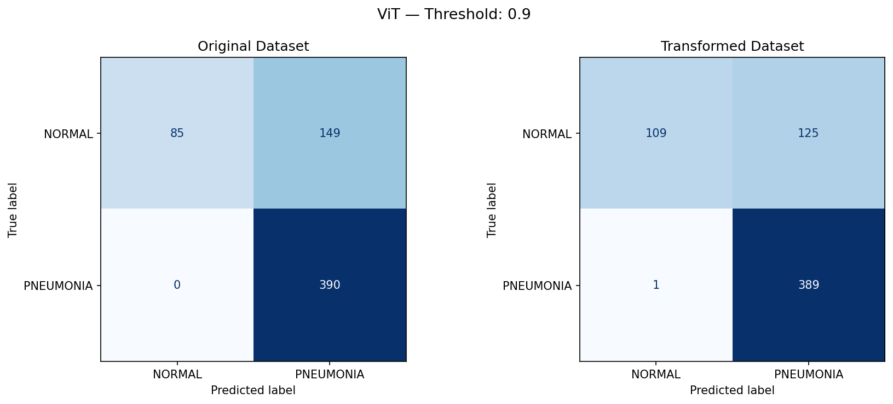

# Analysing Medical Image Model Dependence on Imaging Protocols

## Directory and Files

- `create_combined_ds.py`:
    - this simply creates a combined csv dataset
    - goes through original and transformed dataset csv, picks half og samples, half transformed samples, and creates one csv
    - ensures the same patient is not included twice
- `train_CNN_updated.ipynb`:
    - this notebook handles preprocessing dataset, training the CNN, and saving the model as well as learning curves
- `analysis_CNN.ipynb`:
    - this notebook is where I tested all my trained CNNs on each dataset type and analysed model performance across datasets
    - explore model dependency on medical imaging protocol
- `train_curves/`:
    - folder with saved images of training loss and accuracy curves
    - has plot for original model, transformed model and combined model
- `CM/`:
    - folder with saved images of confusion matrices from testing each model on each type of dataset
    - has plot for original model, transformed model, combined model and the fine tuned ViT
- `analysis/`:
    - folder with saved images of the histogram plots from the analysis notebook, and the RoC curve plots
- `ViT_Study/`:
    - this folder holds 2 notebooks focused on fine tuning a pretrained ViT and testing it on both the original and transformed dataset
    - (note: most code was taken from youtube tutorials and online resources)


## Overview

Different medical facilities use different imaging protocols which could be variations in machine, settings/calibrations, noise levels, and resolution. Given that medical data is hard to procure, most models end up being trained on data obtained from a single source/institute which means that the images obtained are captured using a single protocol. These models perform well on their dataset but that made me question: are these models robust enough to generalise across different protocols? Does a model depend heavily on the imaging protol? This project aims to look at that question by training CNNs on chest X-ray data and evaluating them across protocol conditions.

My approach was: identify an X-ray dataset and produce an augmented dataset. The same chest X-ray images are used in two versions: original and a transformed version simulating a different imaging protocol. Models are trained on one version and evaluated on both, to show the degree to which learned features are protocol-specific. Finally, a model was trained on a combination of the 2 datasets to see if images from different sources can help mitigate any protocol-specific problems. 

---

## Dataset and Preprocessing

I used the Kaggle Chest X-Ray Pneumonia dataset (5,856 images with binary labels: NORMAL / PNEUMONIA). The dataset was already split into train, validation, and test sets.

To simulate a different imaging protocol, the original X-rays were transformed by adjusting contrast, blur, noise levels, and intensity. I looked online to identify visual properties that differ across machines and protocol settings. The key idea is that the underlying X-ray/anatomy stays identical across both versions, only the image appearance changes. This way it controls for other factors like anatomical differences, and just isolates iimaging protocol as the studied factor for any difference. 

The class distribution is pretty imbalanced though with approximately 60% PNEUMONIA, 40% NORMAL cases. I accounted for this by using class-weighted cross entropy loss during training, with:

```
weight_class = total_samples / (2 × n_class)
```

I had looked online to see how to manage class imbalances and this felt like the appropriate step. One other solution was to augment more X-rays to balance classes however to maintain imaging protocol and anatomy, this would just mean exact repeats in the dataset. Another option was also to drop Pneumonia cases to balance classes but that would lead to the loss of a lot of data. 

---

## Model Architecture

I used a simple 4-block CNN and it was kept shallow on purpose to avoid overfitting on a dataset of this size. The same model was used across the study, only the dataset used for training was changed where needed:

```
Block 1–4: Conv2D -> BatchNorm -> ReLU -> MaxPool2D
Classifier: GlobalAveragePooling2D -> Dense(256, ReLU) -> Dropout(0.5) -> Dense(1, Sigmoid)
```

Based on the TA's response on checkpoint 7, I revised my CNN model. Originally the final classifier layer was `Flatten → BatchNorm → Dense` but i replaced this with `GlobalAveragePooling2D → Dense` on the TA's advice (and I understood why). The original attempt had a BatchNorm layer after a 50,176-dimensional flattened vector, introducing ~200K normalisation parameters and causing gradient instability (visible as training loss increasing while accuracy improved showing instable gradients. These curves are in the week7 folder). Replacing Flatten with global average pooling reduced the classifier input from 12,544 to 256 features, stabilised training, and reduced the parameter count of the Dense head from 12.8M to 65K.

This change initially did cause problems because my model started to perform poorly; although the class instability was accounted for, the model still predicted most inputs as Pneumonia since it was the majority class. I changed the early stopping and saving best model based on validation AUC, and also tested various thresholds to find an appropriate threshold which leads to the best model performance. These changes improved model performance; shifting the threshold for classification from 0.5 to a bespoke threshold for each model drastically influenced the result quality.

### Training Curves

The revised model shows a stable training loss that decreases steadily across all 20 epochs. Validation loss does oscillate  though but I believe that is due to the small validation set; however it also moves in the general downward trend. This is a major improvement from the week 7 model train curves where validation loss spiked repeatedly and loss/accuracy moved in the upwards directions.




---

## Experiment Design

Three models were trained and evaluated:

| Model | Training Data |
|-------|--------------|
| Original Model | Original X-rays only |
| Transformed Model | Transformed X-rays only |
| Combined Model | Mix of both (no patient overlap) |

Each model was then tested on both the original and transformed test sets, producing 6 combinations total. For the combined model, I made sure that images of the same patient did not appear in both the original and transformed training portions; including the same patient in both forms would be unrealistic, as two X-rays of the same patient under different protocols with identical internal states is not a clinically realistic scenario (I have explained this in the analysis_CNN notebook too).

All models had different thresholds obtained through the same process: after training different thresholds were tested across a range, and the one producing the best f1 score (balancing precision and recall) was chosen. The threshold was only identified based on the the dataset the model was trained on however. This was delibrate because in a realistic situation, we cannot change the threshold on each run even if the protocol changes. This means the native and foreign data metrics are not directly comparable in, but it shows a realistic understanding of foreign data performance on the model. 

---

## Results

### Confusion Matrices

**Original Model**



The original model performs well on the original dataset but drops substantially on transformed data. NORMAL recall drops from 0.744 to 0.402 as the model misclassifies 140 of 234 NORMAL cases as PNEUMONIA on the transformed test set.

**Transformed Model**



The transformed model shows a more interesting result. On the transformed dataset it performs comparably to the original model on the original dataset. However, the transformed model's performance on the original dataset sees a NORMAL recall collapses to 0.440; even lower than the original model's cross-protocol failure. This suggests the transformed model has learned an even more protocol-specific representation.

**Combined Model**



The combined model shows more balanced cross-protocol generalisation. NORMAL recall on the transformed dataset (0.756) is substantially higher than the original model achieves on that same dataset (0.402). However, original dataset performance is slightly lower than the specialist models.

However one can argue that the main metric to focus on is false negatives: Pneumonia cases classified as healthy/normal. However, we also need to balance this with the idea of false positives; if the false positive rate is really high, then we don't really have a useful model as it is labelling almost all inputs as having Pneumonia which doesn't provide much help.

### Summary Metrics

| Model | Test Dataset | NORMAL Recall | NORMAL F1 | PNEUMONIA Recall | AUC |
|-------|-------------|--------------|-----------|-----------------|-----|
| Original | Original | 0.744 | 0.817 | 0.954 | 0.941 |
| Original | Transformed | 0.402 | 0.436 | 0.736 | 0.587 |
| Transformed | Original | 0.440 | 0.602 | 0.987 | 0.924 |
| Transformed | Transformed | 0.705 | 0.775 | 0.931 | 0.916 |
| Combined | Original | 0.628 | 0.742 | 0.962 | 0.918 |
| Combined | Transformed | 0.756 | 0.776 | 0.885 | 0.911 |

### ROC Curves



The ROC curves provide a threshold-independent view of model quality. On the original dataset (left plot), all three models perform comparably with AUCs of 0.94, 0.92, and 0.92 respectively; the differences are small could be insignificant and be due to noise. This changes significantly on the transformed dataset (right plot): the original model's AUC collapses to 0.587, not too above random guessing (0.5), while the transformed and combined models maintain AUCs of 0.916 and 0.911. This is the clearest quantitative signal of protocol dependency. It could be suggestested that the models trained on the combination and transformed dataset, since looking at noisier and lower resolution data, gets pushed to learn more anatomical structures which get more clearer in the normal X-ray dataset which is why these models perform well across both datasets.  

### Probability Distributions



The histograms show the raw probability counts and give a deeper look into the AUC collapse. For the original model on its own dataset (top left), NORMAL cases are distributed near 0 while PNEUMONIA cases (red) group near 1.0; the classes are well separated. On the transformed dataset (top right), the NORMAL distribution shifts dramatically toward 1.0, overlapping a lot more with the PNEUMONIA distribution. This is interesting as the model is still producing varied probabilities but it reflects genuine loss of class separability when the input distribution shifts.

The transformed and combined models show more stable NORMAL distributions across both datasets, consistent with their maintained AUCs.

---

## Additional Experiment: ViT Fine-tuning

I had some time so I also tried an extension to this study: I finetuned a pre-trained Vision Transformer (ViT-small-patch16-224, 22M parameters) on the original training dataset using the HuggingFace Trainer API with class-weighted cross-entropy loss. 

The idea is that pretrained models, although not pretrained on medical images, have 'seen' so many images and have a better understanding of textures, colours, structures, resolution, etc. So by fine tuning a pretrained ViT on the original dataset, I wanted to see if it could still perform well on the transformed dataset. My assumption is that it will do better than the CNNs i trained as since the ViT has a better understanding of images, it should be less dependent on things like resolution, blur, etc. 

This wasn't part of my original study, but I was just curious to explore this idea and see whether it could be solution to overcome the imaging dependencies seen in the CNNs I trained by scratch.

(**Note**: This section was not very well executed. I have fine tuned ViT before but i had forgotten a lot and followed a youtube tutorial and online resources. And the results did not come out as I expected)



At threshold 0.9, the ViT achieves PNEUMONIA recall of 1.00 on both datasets (zero false negatives) but NORMAL recall of 0.36 on the original and 0.47 on the transformed dataset. Despite the ViT's stronger image understanding, it shows a similar pattern to the CNN: strong PNEUMONIA detection with weaker NORMAL recall, and the class imbalance continues to dominate even with weighted loss.

However, an interesting thing to note is that NORMAL recall on the transformed dataset (0.47) is slightly higher than on the original (0.36), which is the opposite of the CNN pattern. This may reflect that the ViT is more indifferent to low-level visual properties like noise and contrast than CNNs however the difference is small. 

I had assumed a ViT despite being trained on a single dataset would outperform the CNN and produce good results for both the original and transformed dataset. This was backed by my understanding that since the ViT was pretrained on such a large corpus of data, it would have a better 'understanding' of structures, textures, noise, resolution variation, etc. and would therefore not be influenced as much by the imaging protocol. However this assumption clearly did not hold. I would argue that a larger ViT like google's pretrained ViT could do better, but I did not have the compute or time to really explore that. I do still believe a more complex pretrained model would do better than a CNN trained from scratch, but I guess this short study shows that the protocol dependency would still exist; the extent to which it exists is still an interesting question!

---

## Discussion

### Does protocol dependency exist?

Yes; it seems clear at least from this study. The original model's AUC drops from 0.941 on its original dataset to 0.587 on the transformed dataset was a drastic jump. The confusion matrices confirm the mechanism: the model does not collapse entirely, but its ability to correctly identify NORMAL cases falls sharply. The increase in false negatives (pneumonia cases labelled as healthy) and false positives (healthy cases labelled as having pneumonia), especially for the original dataset model when switching to the other dataset just shows the model is getting more confused. This can have real clinical consequences where we can't have a 'dumb' model labelling everything as pneumonia or even worse...seing pneumonia cases going undetected. The transformed model also starts to label everything as pneumonia when the dataset is changed.   

### Does training on combined data help?

Yes, with a tradeoff. The combined model's cross-protocol AUC (0.911) is close to the transformed model's native AUC (0.916), meaning it nearly matches specialised performance on transformed data without sacrificing much on original data. The cost is a modest reduction in native performance: NORMAL recall on the original dataset drops from 0.744 (original model) to 0.628 (combined model). Whether this tradeoff is good enough depends on clinical needs and requirements; if the protocol is known, a specialist model is better, if not, the combined model is a better generalisable solution.

### Limitations

**Threshold selection:** Thresholds were chosen by sweeping over the test data, which is bad practice and should be chosen looking at validation data instead.

**Protocol Difference Augmentation:** The transformed dataset was produced by applying image processing augmentations (contrast, blur, noise) trying to approximate protocol differences. These were my 'best guess' approaches, but might not completely align with realistic protocol differences. The actual shift between real protocols could be more or less severe than what I produced so the results may be exaggerated or too lenient.

**Single dataset:** All results are from one dataset (Kaggle Chest X-Ray Pneumonia). The influence of the protocol dependency effect may be different across datasets, patient populations, and disease types. One could argue that this study would not hold for other disease identification processes, or maybe even other forms of medicial imaging (CT scans, MRI, ultrasound, etc).

**ViT experiment:** The ViT was only fine-tuned on original data and not evaluated to the extend the CNN was. The ViT results are just exploratory and not very in depth.